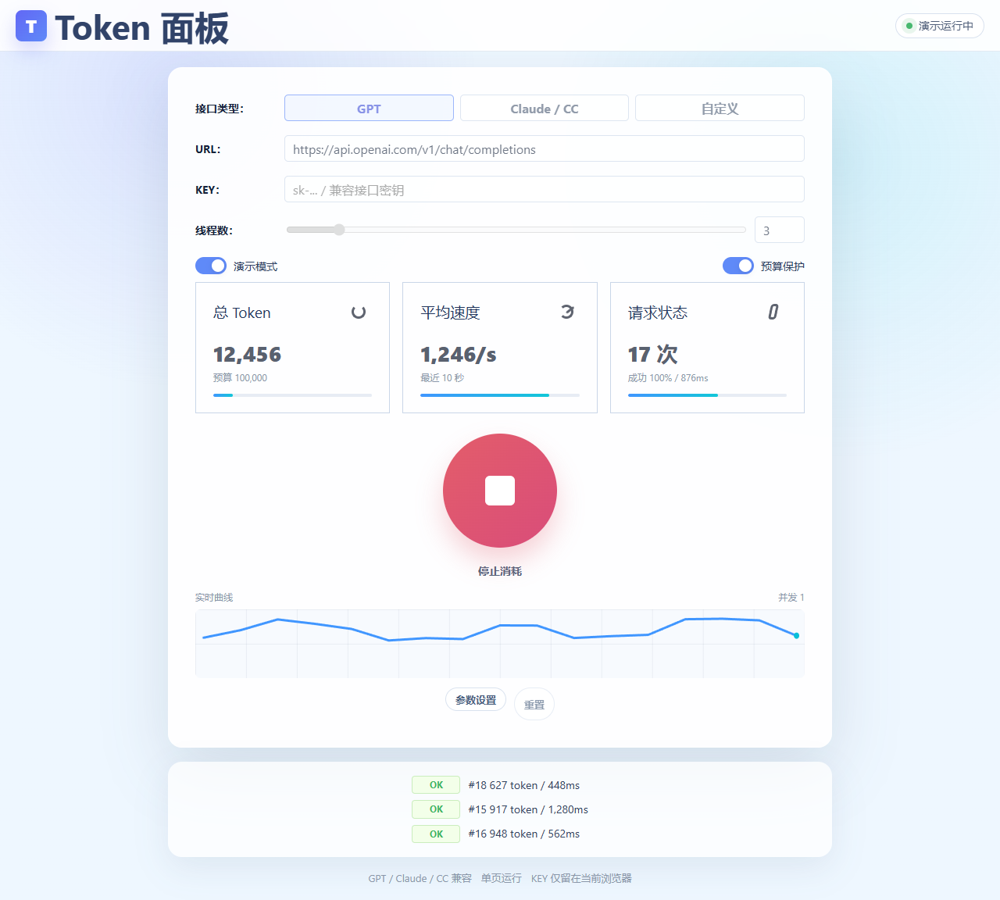
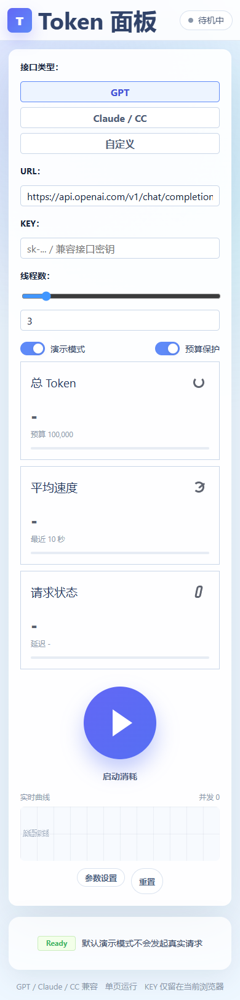

# Token 面板

> 一个轻盈、优雅、单页完成的在线 Token 消耗控制台。适合在可控预算内消耗闲置额度，并实时观察吞吐、请求状态与消耗曲线。

[](https://gitstq.github.io/token-xiaohao/)
[](https://vercel.com/new/clone?repository-url=https://github.com/gitstq/token-xiaohao)
[](https://app.netlify.com/start/deploy?repository=https://github.com/gitstq/token-xiaohao)



## ✨ 项目亮点

- 🎛️ **一个页面完成全部操作**：URL、KEY、模型、线程数、预算、轮次和输出上限都在同一页面内配置。
- 🚀 **兼容 GPT 与 Claude / CC**：内置 GPT Chat Completions 风格请求体，也支持 Claude Messages 风格接口。
- 📈 **实时数据监控**：总 Token、平均速度、请求状态和实时曲线同步刷新。
- 🛡️ **预算保护**：默认启用预算保护，达到 Token 预算后自动停止。
- 🧪 **演示模式**：默认不发真实请求，用模拟数据预览界面和监控效果。
- 🔐 **密钥不落盘**：KEY 只存在当前浏览器页面状态中，不会写入仓库或本地文件。
- 🎨 **简洁高级 UI**：参考网络面板风格，清爽浅色、核心指标优先、操作按钮醒目。

## 🖼️ 移动端效果



## ⚙️ 使用方式

1. 打开在线页面或本地 `index.html`。
2. 选择接口类型：`GPT`、`Claude / CC` 或 `自定义`。
3. 填写兼容接口的 `URL` 和 `KEY`。
4. 调整线程数，必要时展开「参数设置」修改模型、预算和轮次。
5. 点击中间的播放按钮开始消耗，再次点击可停止。

> 真实模式会调用你填写的接口并产生用量。若供应商拦截浏览器跨域请求，请填写支持 CORS 的兼容转发 URL。最终计费以供应商后台为准。

## 🔌 接口兼容说明

| 类型 | 默认 URL | 鉴权方式 | 请求格式 |
| --- | --- | --- | --- |
| GPT | `https://api.openai.com/v1/chat/completions` | `Authorization: Bearer <KEY>` | Chat Completions |
| Claude / CC | `https://api.anthropic.com/v1/messages` | `x-api-key: <KEY>` | Messages |
| 自定义 | `https://example.com/v1/chat/completions` | `Authorization: Bearer <KEY>` | GPT 兼容 |

## 🚀 一键部署

你可以直接点击上方按钮部署到 Vercel 或 Netlify，也可以 Fork 后启用 GitHub Pages。本仓库已包含 `.github/workflows/pages.yml`，推送到 `main` 分支后会自动发布静态页面。

```bash
git clone https://github.com/gitstq/token-xiaohao.git
cd token-xiaohao
python -m http.server 5173
```

然后访问：

```text
http://127.0.0.1:5173/index.html
```

## 🧭 设计取向

Token 面板把复杂参数收纳在轻量设置区，把高频操作集中在一个主按钮上，把实时状态压缩为三张指标卡和一条曲线。它不是复杂后台，而是一个即开即用、干净利落的 Token 消耗面板。
